<!--## Hi there 👋

<!--
**shankartce/shankartce** is a ✨ _special_ ✨ repository because its `README.md` (this file) appears on your GitHub profile.

Here are some ideas to get you started:

- 🔭 I’m currently working on ...
- 🌱 I’m currently learning ...
- 👯 I’m looking to collaborate on ...
- 🤔 I’m looking for help with ...
- 💬 Ask me about ...
- 📫 How to reach me: ...
- 😄 Pronouns: ...
- ⚡ Fun fact: ...
-->

<h1 align="center">Hi there 👋, I'm Shankar</h1>
<h3 align="center">Tech Enthusiast | GenAI Explorer | Builder</h3>

  

---

## About Me

- 🤖 I am interested in **Generative AI, LLM applications, AI agents, and automation**
- ⚡ I enjoy building projects that connect **software, hardware, and intelligence**
- 🌱 Currently learning **LangChain, agent frameworks, Python automation, and embedded development**
- 💬 Ask me about **Python, AI tools, GitHub, embedded systems, and beginner-friendly project ideas**
- 📫 Reach me at: **mailmeshankz@gmail.com**
- 🌐 Portfolio: **shankar-pounraja.me**

---

## What I'm Working On

- Intelligent AI-powered applications
- Agent-based workflows and orchestration
- Embedded and IoT project development
- Research-oriented technical projects
- GitHub-based learning and personal branding

---

## Tech Stack

### Languages

  

### Tools & Frameworks

  

### AI / Data / Automation

  

> I also work with tools like **LangChain, Llama.cpp, agent frameworks, and Python-based automation**.

---

## Featured Interests

- 🤖 LLM apps and AI agents
- 🧠 Retrieval-Augmented Generation (RAG)
- ⚙️ Automation scripts and workflows
- 🔋 Battery systems and EV-related projects
- 🔌 Embedded systems and hardware integration

---

## Projects I Like Building

- AI chatbots and assistant tools
- Document Q&A systems
- Research-support tools
- Smart monitoring and control systems
- Mini projects for college presentations and hackathons

---
## GitHub Stats

  

  

  

---

## Connect With Me

  
  
  

---

## Fun Fact

I like turning ideas into practical projects — especially when AI and engineering work together.
