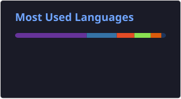

### Hi, I'm Shankar 👋

I'm an AI engineer with a B.E. in Electrical & Electronics Engineering from Thiagarajar College of Engineering (2026), currently an AI & Software Development Intern at Kactii. I build **LLM apps, RAG systems and AI agents** that are fast, grounded and pleasant to use.

🟢 **Open to full-time roles and freelance work.** [Get in touch →](https://shankar-pounraja.me/#contact)

### 🚀 Featured work

<table>
<tr>
<td width="50%" valign="top">

<h4><a href="https://github.com/shankartce/earshot">🎧 Earshot</a></h4>
Listen to music together, in sync, from anywhere. Everyone plays their own copy; nothing is uploaded. Listeners stay within tens of ms.  
<code>TypeScript</code> <code>Preact</code> <code>Socket.IO</code>  
<a href="https://earshot-30yv.onrender.com"><b>Live demo ↗</b></a>
</td>
<td width="50%" valign="top">
<h4><a href="https://github.com/shankartce/rag-agent">🔎 RAG Research Agent</a></h4>
A ReAct research assistant that retrieves before it answers and cites every claim inline, with Answer · Sources · Confidence output.  
<code>Python</code> <code>AgentScope</code> <code>Vector DB</code>
  
<h4><a href="https://github.com/shankartce/voiceflow">🎙️ Murmur</a> building now</h4>
Private voice typing for Windows. Hold a key, speak, and clean text appears anywhere. Speech-to-text and AI cleanup run fully on-device.  
<code>Rust</code> <code>Tauri</code> <code>whisper.cpp</code> <code>llama.cpp</code>
</td>
</tr>
</table>

### 🛠️ Tech

Plus **LangChain, AgentScope, Azure AI Foundry, llama.cpp** and **whisper.cpp**.

### ✍️ Latest writing

<!-- BLOG-POST-LIST:START -->
- [Building Multilingual AI Apps with Azure Translator and Azure Speech](https://shankartce.github.io/building-multilingual-ai-apps-with-azure-translator-and-azure-apeech.html)
- [Develop an Azure Speech Voice Live Agent in Microsoft Foundry](https://shankartce.github.io/develop-azure-speech-voice-live-agent.html)
- [Develop a Speech Agent with the Azure Speech MCP Server](https://shankartce.github.io/develop-speech-agent-with-azure-speech-mcp-server.html)
<!-- BLOG-POST-LIST:END -->

➡️ [All posts](https://shankartce.github.io) · [PyNotes](https://shankartce.github.io/pynotes/)

<b>📊 Languages I code in</b>

 

